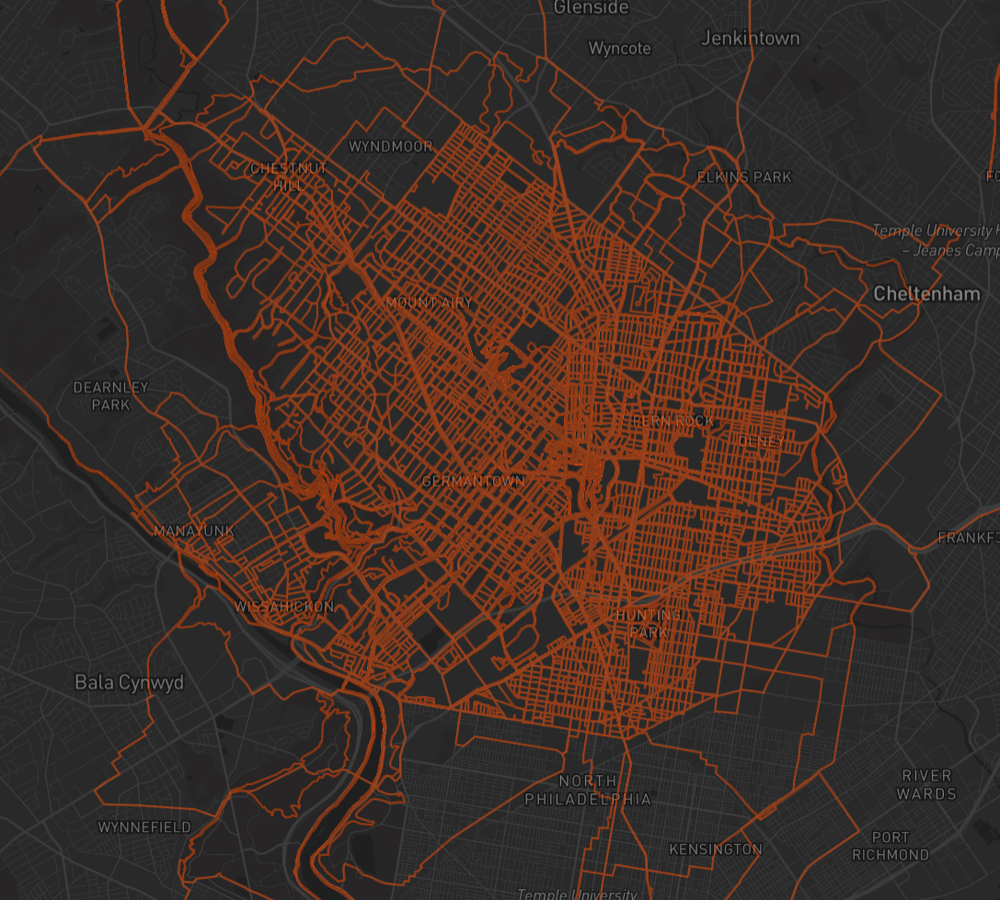

# SleeveMap

A full-stack activity mapping platform built on the Strava API. Connect your Strava account and see every road you've ever covered — stitched together on a single living map. Streets are the arms of a city, your runs are the sleeves keeping them warm.



---

## Features

- **Activity map** — every run, ride, hike, and walk from your Strava history rendered as an interactive polyline map
- **Public profiles** — optionally share your map at a public URL (`/u/your_username`). No account needed to view
- **Explorer** — browse all athletes on the platform, view public maps, and star athletes you want to plan with
- **Route planner** — plan new routes with snap-to-road routing (run, cycle, or straight line), per-segment profile switching, GPX export, and friend heatmap overlays
- **Activity type filters** — multi-select toggles to show/hide run, ride, hike, walk, and swim routes
- **Custom colours** — personalise the colour of each activity type on your map
- **Real-time sync** — new Strava activities appear automatically via webhook
- **Favourites** — star public athletes to overlay their heatmaps in the route planner

---

## Tech Stack

| Layer | Technology |
|---|---|
| Frontend | Next.js 16 (App Router), TypeScript |
| Map rendering | Mapbox GL JS |
| Database | PostgreSQL with PostGIS (via Supabase) |
| Auth | Strava OAuth 2.0, httpOnly cookies |
| Hosting | Vercel |
| Strava integration | REST API + webhooks |

---

## Getting Started

### Prerequisites

- Node.js 18+
- A [Strava API application](https://developers.strava.com)
- A [Supabase](https://supabase.com) project with PostGIS enabled
- A [Mapbox](https://mapbox.com) account and public token

### 1. Clone and install

```bash
git clone https://github.com/Chanelmuir/Strava-Heatmap.git
cd Strava-Heatmap/my-app
npm install
```

### 2. Environment variables

Create a `.env` file in `my-app/`:

```bash
NEXT_PUBLIC_SUPABASE_URL=https://your-project.supabase.co
SUPABASE_SERVICE_ROLE_KEY=your_service_role_key

STRAVA_CLIENT_ID=your_client_id
STRAVA_CLIENT_SECRET=your_client_secret
STRAVA_WEBHOOK_VERIFY_TOKEN=a_random_string_you_choose

NEXT_PUBLIC_MAPBOX_TOKEN=your_mapbox_token
NEXT_PUBLIC_APP_URL=http://localhost:3000
```

### 3. Database setup

Run the following in the Supabase SQL Editor in order:

```sql
-- Enable PostGIS
create extension if not exists postgis;

-- Users table
create table users (
  id                uuid primary key default gen_random_uuid(),
  strava_id         bigint unique not null,
  username          text unique,
  full_name         text,
  avatar_url        text,
  access_token      text not null,
  refresh_token     text not null,
  token_expires_at  timestamptz not null,
  is_public         boolean default false,
  activity_colors   jsonb default '{"Run":"#FC4C02","Ride":"#3498DB","Hike":"#27AE60","Walk":"#F39C12","Swim":"#9B59B6"}',
  last_synced_at    timestamptz,
  created_at        timestamptz default now(),
  updated_at        timestamptz default now()
);

-- Activities table
create table activities (
  id             uuid primary key default gen_random_uuid(),
  user_id        uuid not null references users(id) on delete cascade,
  strava_id      bigint unique not null,
  name           text,
  type           text,
  start_date     timestamptz,
  distance_m     float,
  moving_time_s  int,
  elevation_m    float,
  route          geometry(LineString, 4326),
  created_at     timestamptz default now()
);

create index activities_user_id_idx on activities(user_id);
create index activities_route_idx on activities using gist(route);

-- Favourites table
create table favourites (
  id         uuid primary key default gen_random_uuid(),
  user_id    uuid not null references users(id) on delete cascade,
  target_id  uuid not null references users(id) on delete cascade,
  created_at timestamptz default now(),
  unique(user_id, target_id)
);
```

Then run the remaining SQL functions from the `/sql` folder (3-7). 

### 4. Strava app settings

In your [Strava API settings](https://www.strava.com/settings/api):
- Set **Authorization Callback Domain** to `localhost` for development or your production domain

### 5. Run locally

```bash
npm run dev
```

Open [http://localhost:3000](http://localhost:3000).

---

## Strava Webhook (production only)

Webhooks require a public URL. After deploying, register your webhook:

```bash
curl -X POST https://www.strava.com/api/v3/push_subscriptions \
  -F client_id=YOUR_CLIENT_ID \
  -F client_secret=YOUR_CLIENT_SECRET \
  -F callback_url=https://yourdomain.com/api/webhook \
  -F verify_token=YOUR_STRAVA_WEBHOOK_VERIFY_TOKEN
```

---

## Project Structure

```
my-app/
  src/
    app/
      api/
        activities/     — GeoJSON activity feed
        auth/
          strava/       — OAuth initiation
          callback/     — OAuth callback, token exchange
          logout/       — Session clear
        favourites/     — Star/unstar athletes
        me/             — Get/update own profile
          delete/       — Account deletion
        profiles/       — Public profile list
          [username]/   — Single public profile + activities
        stats/          — Site-wide stats
        sync/           — Full Strava activity sync
        webhook/        — Strava webhook receiver
      components/
        Navbar.tsx
        SyncOnLoad.tsx
      explore/          — Explorer page
      legal/            — Privacy policy + terms
      map/              — Redirect to /u/[username]
      plan/             — Route planner
      settings/         — Account settings
      u/[username]/     — Public + private map page
      page.tsx          — Landing page
```

---

## Deployment

The project is deployed on Vercel. Add all environment variables from `.env` to your Vercel project settings before deploying. Update `NEXT_PUBLIC_APP_URL` to your production domain.

---

## License

MIT

---

## Disclaimer

SleeveMap is an independent personal project and is not affiliated with, endorsed by, or sponsored by Strava, Inc. The Strava name and logo are trademarks of Strava, Inc.