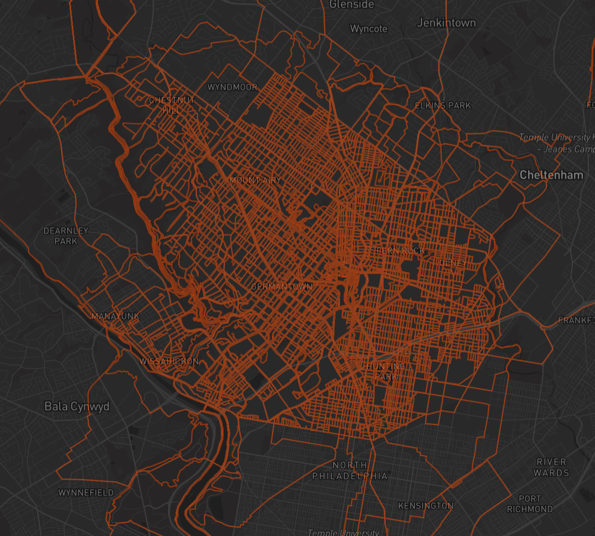
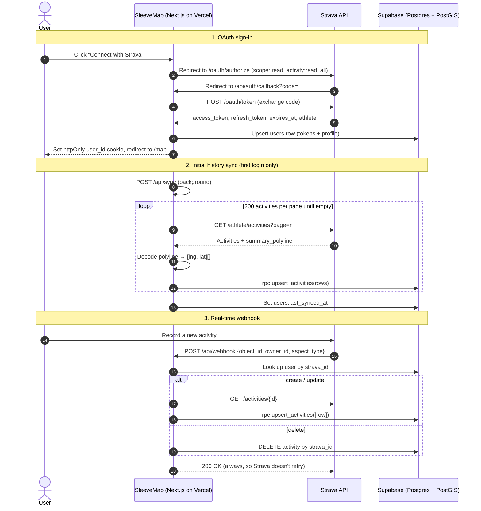

# SleeveMap

A full-stack activity mapping platform built on the Strava API. Connect your Strava account and see every road you've ever covered — stitched together on a single living map. Streets are the arms of a city, your runs are the sleeves keeping them warm.



> **Project status — Strava integration disabled.**
> Strava now charges for API access, so sign-in with Strava, activity sync and webhook ingestion have been switched off. Everything synced before the change is still live: public maps, the Explorer and the route planner all work from the existing database. The integration code is intact and documented below in [How the Strava integration worked](#how-the-strava-integration-worked). It can be re-enabled by setting `STRAVA_ENABLED = true` in [`my-app/app/lib/strava.ts`](my-app/app/lib/strava.ts).

---

## Features

- **Activity map** — every run, ride, hike, and walk from your Strava history rendered as an interactive polyline map
- **Public profiles** — optionally share your map at a public URL (`/u/your_username`). No account needed to view
- **Explorer** — browse all athletes on the platform, view public maps, and star athletes you want to plan with
- **Route planner** — plan new routes with snap-to-road routing (run, cycle, or straight line), per-segment profile switching, GPX export, and friend heatmap overlays
- **Activity type filters** — multi-select toggles to show/hide run, ride, hike, walk, and swim routes
- **Custom colours** — personalise the colour of each activity type on your map
- **Real-time sync** — new Strava activities appear automatically via webhook *(disabled, see project status)*
- **Favourites** — star public athletes to overlay their heatmaps in the route planner

---

## Tech Stack

| Layer | Technology |
|---|---|
| Frontend | Next.js 16 (App Router), TypeScript |
| Map rendering | Mapbox GL JS |
| Database | PostgreSQL with PostGIS (via Supabase) |
| Auth | Strava OAuth 2.0, httpOnly cookies |
| Hosting | Vercel |
| Strava integration | REST API + webhooks |

---

## How the Strava integration worked

The Strava side of SleeveMap had three parts: OAuth sign-in, a one-off full history sync, and a webhook for real-time updates. All three wrote into the same PostGIS `activities` table, and every map, profile and planner overlay reads from that table. That's why the site keeps working after the integration was switched off.


```mermaid
sequenceDiagram
    autonumber
    actor U as User
    participant App as SleeveMap (Next.js on Vercel)
    participant S as Strava API
    participant DB as Supabase (Postgres + PostGIS)

    Note over U,DB: 1. OAuth sign-in
    U->>App: Click "Connect with Strava"
    App->>S: Redirect to /oauth/authorize (scope: read, activity:read_all)
    S->>App: Redirect to /api/auth/callback?code=…
    App->>S: POST /oauth/token (exchange code)
    S-->>App: access_token, refresh_token, expires_at, athlete
    App->>DB: Upsert users row (tokens + profile)
    App-->>U: Set httpOnly user_id cookie, redirect to /map

    Note over U,DB: 2. Initial history sync (first login only)
    App->>App: POST /api/sync (background)
    loop 200 activities per page until empty
        App->>S: GET /athlete/activities?page=n
        S-->>App: Activities + summary_polyline
        App->>App: Decode polyline → [lng, lat][]
        App->>DB: rpc upsert_activities(rows)
    end
    App->>DB: Set users.last_synced_at

    Note over U,DB: 3. Real-time webhook
    U->>S: Record a new activity
    S->>App: POST /api/webhook {object_id, owner_id, aspect_type}
    App->>DB: Look up user by strava_id
    alt create / update
        App->>S: GET /activities/{id}
        App->>DB: rpc upsert_activities([row])
    else delete
        App->>DB: DELETE activity by strava_id
    end
    App-->>S: 200 OK (always, so Strava doesn't retry)
```

### 1. OAuth sign-in: `api/auth/strava` → `api/auth/callback`

- `/api/auth/strava` redirects to Strava's authorize page asking for `read,activity:read_all`, so private activities are included too.
- `/api/auth/callback` exchanges the `code` for an access token, a refresh token and an expiry time. It upserts the athlete into `users`, keyed on `strava_id`. New users get a username from their Strava handle, or a generated one if that's taken.
- The session is a 30-day `httpOnly`, `sameSite=lax` cookie holding the internal user id. Strava tokens never reach the browser.
- If the user has no activities yet, the callback starts a background sync and redirects to `/map?syncing=true`, which shows a progress toast.

### 2. Full history sync: `api/sync`

- `getValidToken()` checks `token_expires_at`. Strava access tokens only last about 6 hours, so an expired token is refreshed with the `refresh_token` grant and the new pair is saved back to `users`.
- It walks `/athlete/activities` 200 per page, which is Strava's maximum, until it gets a short page.
- Each activity's `summary_polyline` (Google's encoded polyline format) is decoded with `@mapbox/polyline`. The `[lat, lng]` pairs are flipped to `[lng, lat]` for PostGIS/GeoJSON, and activities without GPS, such as treadmill runs, are skipped.
- Rows go to the `upsert_activities` Postgres function ([`sql/05`](sql/05_function_upsert_activities.sql)). It builds a `LINESTRING` geometry with `ST_MakeLine` and upserts on `strava_id`, so re-syncing is idempotent.
- Users could also re-run this on demand from **Settings → Re-sync Strava**.

### 3. Real-time updates: `api/webhook`

- **Subscription:** a single app-wide subscription registered with Strava's `push_subscriptions` endpoint (see [Strava Webhook](#strava-webhook-production-only)). Strava checks the endpoint with a `GET` carrying `hub.challenge`, which the route echoes back if `hub.verify_token` matches `STRAVA_WEBHOOK_VERIFY_TOKEN`.
- **Events:** Strava `POST`s a small event with the activity id, athlete id and `create`/`update`/`delete`. The route maps the athlete to a SleeveMap user, then either fetches the full activity and upserts it or deletes the row.
- The route always returns `200` quickly. Strava retries anything else, and a failure on one activity shouldn't cause a retry storm.

### Reading the data back

Nothing on the map side talks to Strava. The `get_activities_geojson` and `get_public_activities_geojson` SQL functions ([`sql/06`](sql/06_function_get_activities_geojson.sql), [`sql/07`](sql/07_function_get_public_activities_geojson.sql)) read activity geometry straight from PostGIS. The API routes (`/api/activities`, `/api/profiles/[username]`) turn it into a GeoJSON `FeatureCollection`, and Mapbox GL renders it on the map, profile and planner pages. Because of that split, turning the integration off only stops *new* data; existing data is unaffected.

### How it's disabled

A single flag, `STRAVA_ENABLED` in [`my-app/app/lib/strava.ts`](my-app/app/lib/strava.ts), gates everything:

| Piece | Behaviour when disabled |
|---|---|
| `/api/auth/strava`, `/api/auth/callback` | Redirect to `/?error=strava_disabled` |
| `/api/sync` | `503` with an explanation |
| `/api/webhook` (POST) | Returns `200` and ignores the event |
| Navbar / home "Connect with Strava" | Shown greyed out with an explanatory tooltip |
| Settings "Re-sync Strava" | Button disabled, description explains why |
| Site-wide | One-time notice popup explaining the change |

Signed-in users keep their existing session cookie, so they can still view their own private map and use the planner.

---

## Getting Started

### Prerequisites

- Node.js 18+
- A [Strava API application](https://developers.strava.com)
- A [Supabase](https://supabase.com) project with PostGIS enabled
- A [Mapbox](https://mapbox.com) account and public token

### 1. Clone and install

```bash
git clone https://github.com/Chanelmuir/Strava-Heatmap.git
cd Strava-Heatmap/my-app
npm install
```

### 2. Environment variables

Create a `.env` file in `my-app/`:

```bash
NEXT_PUBLIC_SUPABASE_URL=https://your-project.supabase.co
SUPABASE_SERVICE_ROLE_KEY=your_service_role_key

STRAVA_CLIENT_ID=your_client_id
STRAVA_CLIENT_SECRET=your_client_secret
STRAVA_WEBHOOK_VERIFY_TOKEN=a_random_string_you_choose

NEXT_PUBLIC_MAPBOX_TOKEN=your_mapbox_token
NEXT_PUBLIC_APP_URL=http://localhost:3000
```

### 3. Database setup

Run the SQL functions from the `/sql` folder (1-8) to set up the database on supabase. 

### 4. Strava app settings

In your [Strava API settings](https://www.strava.com/settings/api):
- Set **Authorization Callback Domain** to `localhost` for development or your production domain

### 5. Run locally

```bash
npm run dev
```

Open [http://localhost:3000](http://localhost:3000).

---

## Strava Webhook (production only)

Webhooks require a public URL. After deploying, register your webhook:

```bash
curl -X POST https://www.strava.com/api/v3/push_subscriptions \
  -F client_id=YOUR_CLIENT_ID \
  -F client_secret=YOUR_CLIENT_SECRET \
  -F callback_url=https://yourdomain.com/api/webhook \
  -F verify_token=YOUR_STRAVA_WEBHOOK_VERIFY_TOKEN
```

---

## Project Structure

```
my-app/
  src/
    app/
      api/
        activities/     — GeoJSON activity feed
        auth/
          strava/       — OAuth initiation
          callback/     — OAuth callback, token exchange
          logout/       — Session clear
        favourites/     — Star/unstar athletes
        me/             — Get/update own profile
          delete/       — Account deletion
        profiles/       — Public profile list
          [username]/   — Single public profile + activities
        stats/          — Site-wide stats
        sync/           — Full Strava activity sync
        webhook/        — Strava webhook receiver
      components/
        Navbar.tsx
        SyncOnLoad.tsx
      explore/          — Explorer page
      legal/            — Privacy policy + terms
      map/              — Redirect to /u/[username]
      plan/             — Route planner
      settings/         — Account settings
      u/[username]/     — Public + private map page
      page.tsx          — Landing page
```

---

## Deployment

The project is deployed on Vercel. Add all environment variables from `.env` to your Vercel project settings before deploying. Update `NEXT_PUBLIC_APP_URL` to your production domain.

---

## License

MIT

---

## Disclaimer

SleeveMap is an independent personal project and is not affiliated with, endorsed by, or sponsored by Strava, Inc. The Strava name and logo are trademarks of Strava, Inc.